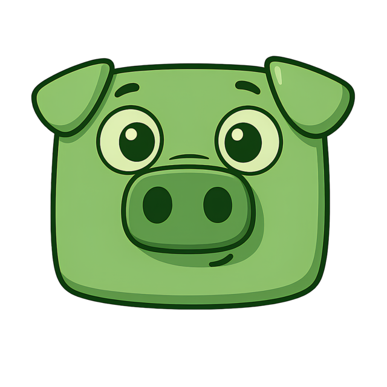

  

<h1 align="center">PorkLauncher</h1>

  <b>Лаунчер проекта PorkLand в игре Hytale</b>
   
  <i>(Based on ArchDev HyLauncher)</i>

  ⚠️ <b>For demo only. Support Hytale developers!</b> ⚠️

  
  

---

## Фичи

- Онлайн режим
- Скачивание игры
- Скачивание всех зависимостей
- Уникальные идентификаторы ников (каждый ник уникальный)
- Поддержка Windows и macOS

---

## Установка

1. Переходим в раздел [releases](https://github.com/Serezjjja/PorkLauncher/releases).
2. Скачиваем самую [последнюю версию](https://github.com/Serezjjja/PorkLauncher/releases/latest) лаунчера.
   > **Note:** Не нужно скачивать `update-helper(.exe)`

---

## Билд

### Зависимости
- Golang 1.24+
- NodeJS 24+
